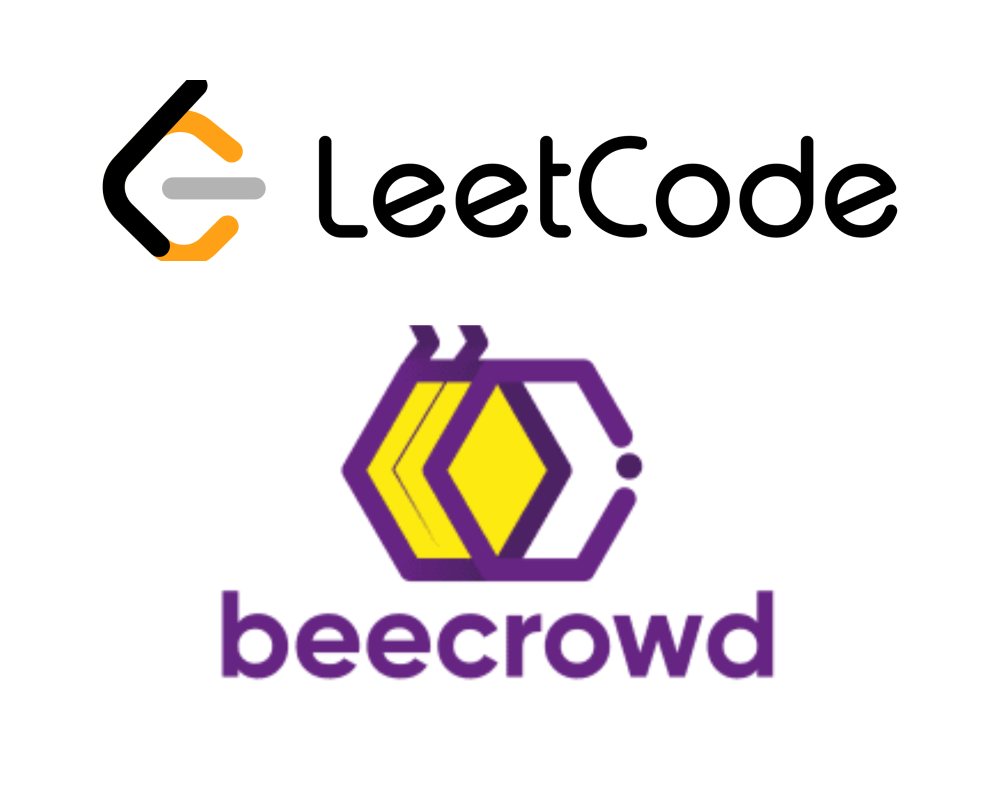

# Training with Beecrowd &amp;&amp; LeetCode

## Exercícios Resolvidos LeetCode

Bem-vindo ao meu diretório de exercícios resolvidos da Plataforma LeetCode! Aqui estão os exercícios que resolvi, organizados por linguagem de programação.

###  

### 

## Exercícios Resolvidos Beecrowd

Bem-vindo ao meu diretório de exercícios resolvidos da Plataforma Beecrowd! Aqui estão os exercícios que resolvi, organizados por linguagem de programação.

###  

###  

###  

###  

### 

## Recursos

Aqui estão alguns recursos úteis para continuar aprendendo e praticando:

- [Leetcode](https://leetcode.com/)
- [Beecrowd](https://www.beecrowd.com.br/judge/en/login)

---

Sinta-se à vontade para explorar os exercícios resolvidos em diferentes linguagens de programação.

